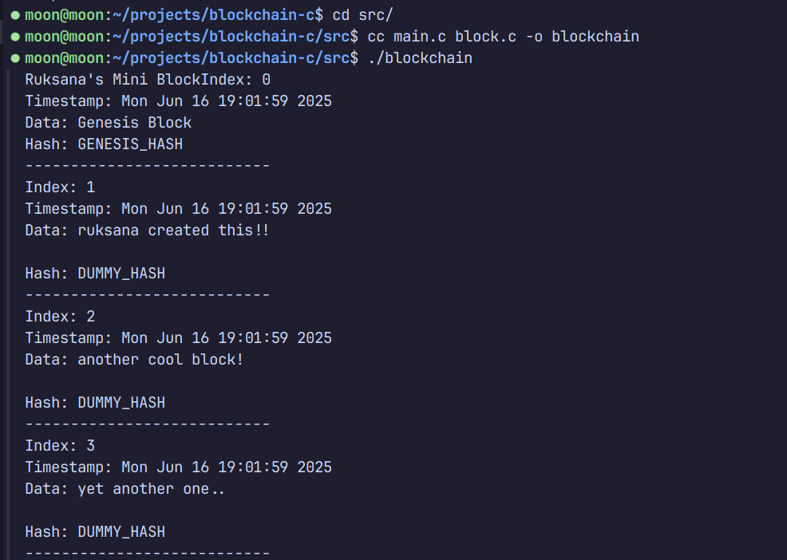

# Ruksana's Mini Blockchain in C

A basic blockchain implementation written in C for learning and portfolio purposes — no libraries, no shortcuts, just raw C code!

Built during my CDAC Embedded Systems course to understand how blockchains work from scratch using low-level logic, memory, and data structures.

---

## Features

- Genesis block creation
- Linked list–based block chaining
- Custom block data
- Timestamps
- Block printing (in terminal)
- Future support for hashing and proof-of-work

---

## Folder Structure


blockchain-c/
├── src/
│ ├── main.c
│ ├── block.c
│ └── block.h
├── docs/
│ ├── block_structure.png
│ └── notes.md
├── README.md
└── LICENSE (optional)

---

##  How to Compile & Run

```bash
cd src
gcc main.c block.c -o blockchain
./blockchain
```
Requires: GCC compiler and Linux/Mac terminal

## Concepts Used
- struct design and chaining (linked list)
- Time and string handling
- Manual memory management
- Block simulation
- Preparing for hashing logic

Screenshot of output


Tags:
C, Blockchain, CDAC, Linked List, Embedded, Low-Level Programming, Portfolio Project  